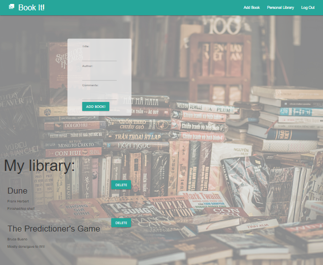

# Book-it Bookshelf
### __Your Personal Book Library__


## Table of Contents:
  1. [Description](#description)  
  2. [Screenshot](#screenshot)
  3. [License](#license) 
  4. [Contributors](#contributors)
  5. [Deployed](#deployed)
  6. [Other](#other)

## Description

```
This application allows users to generate an online library of books they personally own. With a paired note-taking function for added functionality such as: book location, edition, cover art, or pages read.
```
---

## License
MIT

---

## Screenshot
Landing page of the site


</br>

Entry page (there is no verification of email. Login/logout is functional and user specific)


</br>

Your personal library (For best experience refresh the page often)

---

## Contributors

To discuss any contributions, please reach out to:

Mary Lou Hoover |  [ml.hoover@yahoo.com](mailto:ml.hoover@yahoo.com)

Chamo |  [yajochakha@gmail.com](yajochakha@gmail.com)

Mitchell Robbins |  [mitchell.ma.robbins@gmail.com](mailto:mitchell.est.robbins@gmail.com)

Ron Sit | [mrronsit@gmail.com](mailto:mrronsit@gmail.com)

Vincent Sullivan |  [vlsullivanhou@gmail.com](mailto:vlsullivanhou@gmail.com)


---


## Deployed 
## [HERE](https://bookit-bookshelf.herokuapp.com/)

---

## Other

Constructed with Handlebars and MySQL

### Note
This App is still a work in progress. It was made to showcase bootcamp skills but the concept is solid and capable of being built upon.  A direction for future development would include the ability to upload pictures, or pair user generated Title with an API call to gather details like cover art. Additionally, increased quality of life classifications like tags to aid in searches or groupings. 


 ### Dependencies: 
 
 
- "bcrypt": "5.0.0",
- "body-parser": "1.19.0",
- "connect-session-sequelize": "7.0.4",
- "cookie": "0.4.1",
- "cookie-parser": "1.4.5",
- "dotenv": "8.6.0",
- "express": "4.17.1",
- "express-handlebars": "5.2.0",
- "express-session": "1.17.1",
- "morgan": "1.10.0",
- "mysql2": "2.2.5",
- "parser": "0.1.4",
- "sequelize": "6.3.5"


